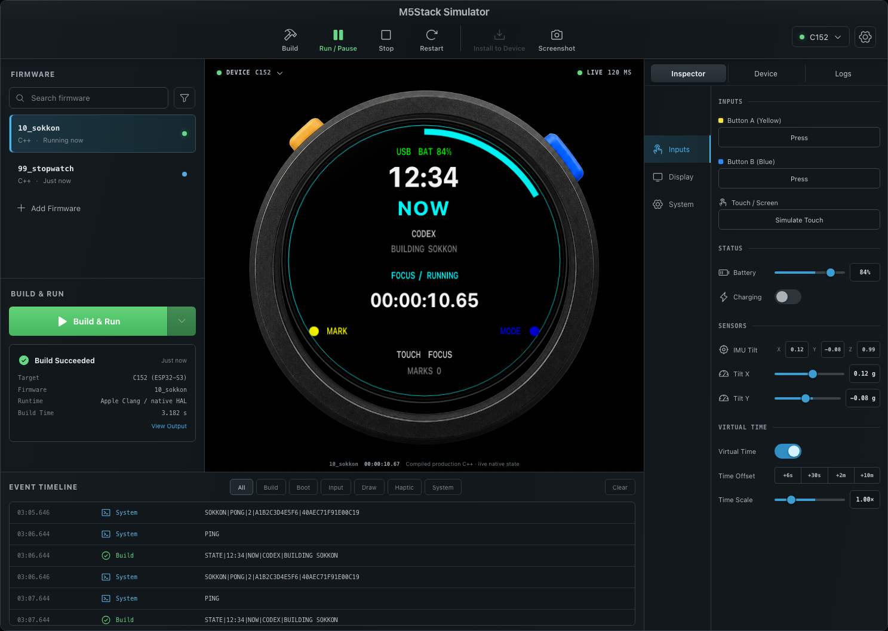
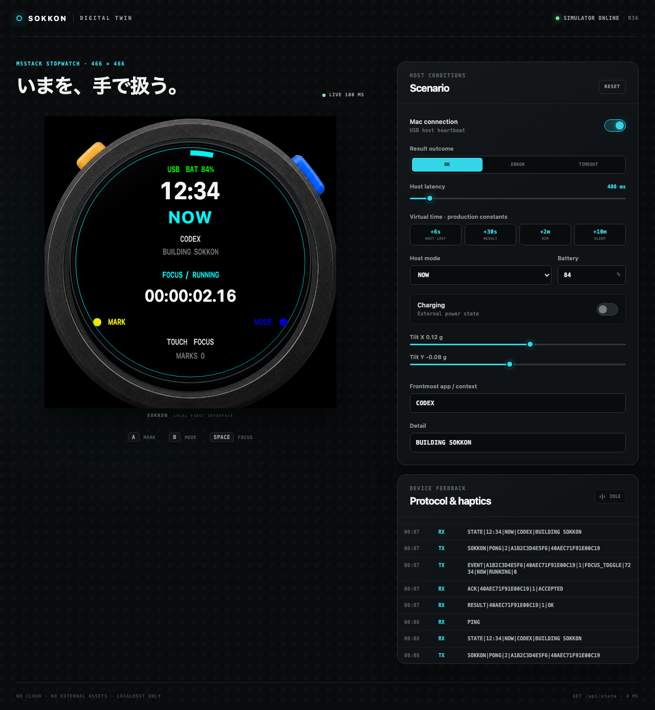
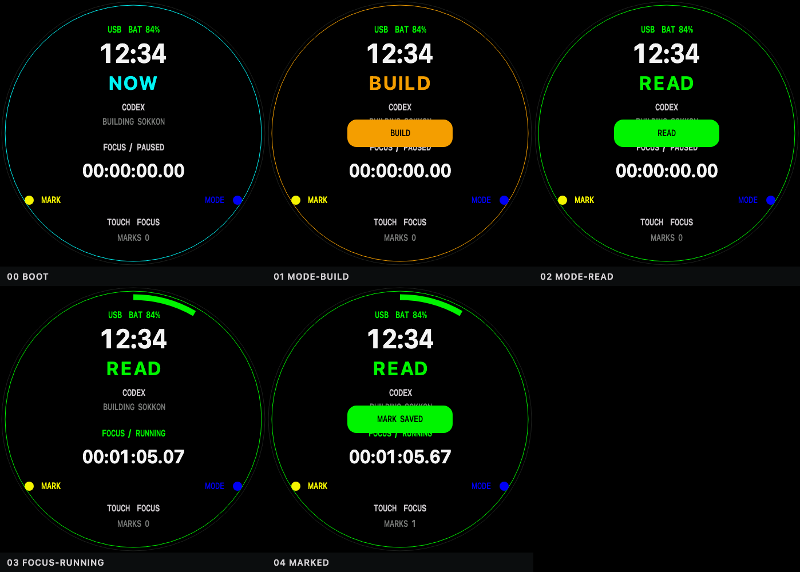
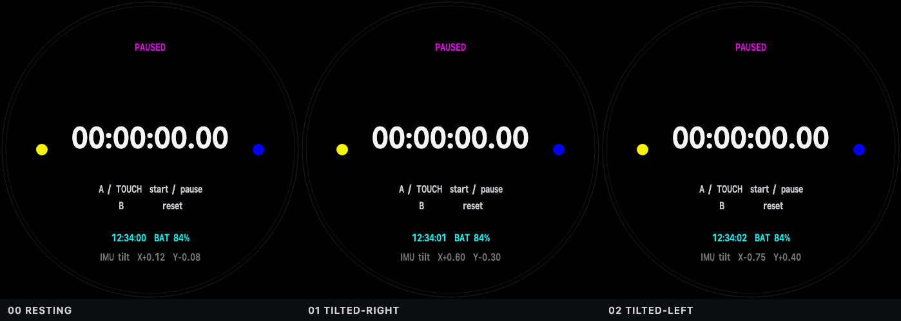

<div align="center">

# M5Stack StopWatch Simulator

**日本語** · [English](README.en.md) · [中文](README.zh-CN.md)

本番ファームウェアの C++ を、そのまま Mac で動かすシミュレータ。<br>
文字の寸法は実機のフォントから計測しているので、画面の判断をここで終わらせられます。

[](https://github.com/ochyai/m5stack-stopwatch-simulator/actions/workflows/ci.yml)
[](LICENSE)
[](macos/M5StackSimulator/README.md)



</div>

M5Stack StopWatch（C152）を、Mac から再現可能な形で調査・開発するためのリポジトリです。丸形 AMOLED、タッチ、2 ボタン、6 軸 IMU、RTC、マイク、スピーカー、振動、Wi-Fi / Bluetooth LE、外部 I2C を、機能別ファームウェアと 1 台のシミュレータで扱います。既定アプリ **SOKKON / 即今** は、この丸い端末を「現在の文脈を物理的に支える界面」に変えます。

> [!CAUTION]
> 一部ロットでは背面端子の `BAT` 印字が誤っています。実際は外部電源用の **5V IN** です。リチウム電池を接続しないでください。M5Stack 公式の訂正事項です。

## なぜ普通のシミュレータと違うのか

- **モックではない。** ブラウザに出ているのは、本番 `main.cpp` と `board.cpp` をホストの C++ コンパイラでビルドして走らせた結果です。UI の状態機械を JavaScript へ複製していません。
- **文字幅を推定しない。** `font_metrics.hpp` は実機が使う M5GFX から計測した生成物で、`sim_text.hpp` は LovyanGFX の `text_width` / `draw_string` を固定小数点まで移植したものです。`10_sokkon` が「300 px に収まるまで `...` で詰める」処理は、実機と同じ位置で切れます。
- **描画命令の解釈は 1 つだけ。** `frame-renderer.js` を両方の UI が import します。どちらで見ても画素は変わりません。
- **タッチは座標を持つ。** 画面のどこを触ってもデバイス座標が本番 `loop()` へ渡ります。「中心から半径 145 px の外は反応しない」という実機の判定を、そのまま確認できます。
- **再生できる。** セッション中は仮想時間が凍結されるので、同じスクリプトはどのマシンでも同じフレームを描きます。だからゴールデンフレームが成立します。

## 30 秒で動かす

実機は不要です。必要なのは Python 3 と C++ コンパイラだけです。

```bash
# 本番C++をコンパイルし、localhostで起動してブラウザを開く
make simulator

# 別の本番コード: A/タッチで開始・停止、Bでリセット
make simulator FIRMWARE=99_stopwatch

# native runner、process bridge、ゴールデンフレーム、UIの回帰テスト
make simulator-test
```



3 ペインのデスクトップ版と、Python も localhost サーバも要らない macOS アプリもあります。

```bash
make workbench-install     # 初回だけ
make workbench             # ファーム切替・Inspector・イベントTimeline
make macos-app             # 自己完結の M5Stack Simulator.app
```

## 実機なしで画面を確かめる

`scenarios/*.sim` は、UI が送るのと同じコマンド（ボタン、タッチ座標、仮想時間、シナリオ、SHOT）だけで書かれた再生スクリプトです。

```text
# scenarios/sokkon-touch-ring.sim
TOUCH 233 60      # リングの外。ファームウェアは無視するはず
SHOT outside-ring
TOUCH 233 233     # ど真ん中。FOCUSタイマーが動く
ADVANCE 3000
SHOT inside-ring
```

```bash
make session SCRIPT=scenarios/sokkon-face.sim
```



`.simulator/sessions/` に、全 SHOT を並べた `contact-sheet.png` と `report.json` が出ます。ブラウザ起動は描画より高価なので、セッション 1 回につき 1 起動です。

`report.json` の findings は好みではなく幾何的事実です。

| severity | 内容 |
| --- | --- |
| `error` | 466 × 466 の外、**丸い** AMOLED の可視円の外、文字同士の重なり、寸法未発行 |
| `notice` | 後から描いた塗りに文字が隠れている（トーストなど、人が判断する） |

`test_simulator/golden/` が各シナリオの描いたフレームを固定しているので、意図しないレイアウト変更はテストで落ちます。意図した変更なら `make golden-update` で更新し、差分をレビューしてからコミットします。ブラウザで触った操作は `python3 -m simulator --record path.sim` でそのまま再生スクリプトになります。

センサーも同じ経路です。下は傾きを変えた 3 枚で、`99_stopwatch` が読んだ加速度がそのまま画面に出ています。



## 仕組み

```text
firmware/apps/10_sokkon/main.cpp ─┐
firmware/shared/board.cpp ─────────┼─ host C++ compiler ─ native runner
Arduino / M5Unified / ESP32 HAL ───┘                         │
                                                            ├─ framebuffer draw commands
browser canvas ◀─ localhost HTTP API ◀─ Python process bridge┼─ protocol / haptic log
                                                            └─ screen / pending state
```

`simulator/native/include/` の薄い HAL が、実機の Arduino、M5Unified、ESP32 API だけを置き換えます。`setup()` と `loop()`、ボタン分岐、タッチ判定、mode 循環、focus timer、USB protocol v2、pending queue、5 秒の host 切断、30 秒の結果不明、2 分の dim、10 分の sleep、画面レイアウトは本番 C++ が実行します。

native runner の共通部分（NDJSON、log ring、シナリオ、時間スケール、コマンドループ）は `sim_host.hpp` にあり、各 runner は 1 つの本番ファームウェア固有の意味論だけを持ちます。3 本目を足すときは `sim_host::Host` を継承し、`FirmwareIdentity` と `screen` ブロックを書けば足ります。

詳細は [Mac Simulator](docs/SIMULATOR.md) を参照してください。

## 実機で使う — SOKKON / 即今

USB Type-C で Mac につなぎ、標準ライブラリだけの companion を起動します。companion 自身はネットワーク通信を行わず、前面アプリ名だけを現在の文脈として端末へ表示します。既定保存先の `Documents` は、macOS / iCloud 設定によって OS が同期する場合があります。

```bash
# 初回だけ: 工場Flashをバックアップした後、SOKKONを書き込む
make build ENV=10_sokkon
make flash ENV=10_sokkon PORT=/dev/cu.usbmodemXXXX

# 初回だけ: 物理接続中のdevice IDをMacへpairする
make companion-pair ARGS="--port /dev/cu.usbmodemXXXX"

# pair後の日常利用: USB companionを起動する
make companion
```

| 操作 | 結果 |
| --- | --- |
| 黄色 A | `~/Documents/Sokkon Inbox.md` へ現在時刻・mode・前面アプリ・focus 時間を MARK |
| 青 B | `NOW → BUILD → READ → MEET → PRESENT → REST` を循環 |
| 画面中央 | FOCUS timer を開始 / 一時停止 |

MARK は Mac が Markdown を `fsync` できた後だけ強い確定振動を返します。未接続と明示的な保存失敗は「未保存」ですが、30 秒応答がない場合は、保存後の応答だけ失われた可能性もあるため `SAVE UNKNOWN` と表示します。任意 shell は実行せず、追加アクションは JSON config に名前を明示した macOS Shortcut だけです。設計、USB protocol v2、プライバシー境界は [SOKKON設計](docs/SOKKON.md) を参照してください。

## 最初の 10 分（実機）

書き込みにはデータ通信対応の USB Type-C ケーブルを使います。**最初の書き込みより先に工場出荷ファームウェアをバックアップ**してください。

```bash
# 端末をダウンロードモードにして、表示されたポートを指定する
./scripts/detect-port.sh
make device-info PORT=/dev/cu.usbmodemXXXX
make backup PORT=/dev/cu.usbmodemXXXX

# 最小診断をビルドして書き込む
make build ENV=00_smoke
make flash ENV=00_smoke PORT=/dev/cu.usbmodemXXXX
make monitor ENV=00_smoke PORT=/dev/cu.usbmodemXXXX
```

ダウンロードモードは、USB 接続後に電源ボタンを約 2 秒長押しし、内部の緑 LED が点灯したら離します。詳しくは [書き込み・復旧手順](docs/FLASHING.md) を参照してください。

## ハードウェア

| 項目 | 内容 |
| --- | --- |
| MCU | ESP32-S3R8、デュアルコア LX7 最大 240 MHz |
| メモリ | 16 MB Flash、8 MB PSRAM |
| 画面 | 1.75 インチ、466 × 466、丸形 AMOLED（CO5300） |
| 入力 | CST820B タッチ、プログラマブルボタン × 2、電源ボタン |
| モーション | BMI270（3 軸加速度 + 3 軸ジャイロ、磁気センサーなし） |
| 音声 | MEMS マイク、ES8311 Codec、1 W / 8 Ω スピーカー |
| その他 | RX8130CE RTC、振動モーター、M5PM1 電源管理、450 mAh バッテリー |
| 無線 | 2.4 GHz Wi-Fi。Bluetooth LE は ESP32-S3 の SoC 機能としてチップ情報で確認。GATT 実動作は未検証 |
| 拡張 | Port A（G10 / G11）と背面 2.54 mm 拡張バス |

心拍、SpO2、GPS/GNSS、環境センサー、カメラ、microSD は内蔵していません。防水・防滴等級は公式仕様で確認できないため、水に濡らさない前提で扱います。詳細は [ハードウェア情報](docs/HARDWARE.md)。

## ファームウェア環境

| PlatformIO 環境 | 確認内容 |
| --- | --- |
| `00_smoke` | ボード、画面、入力の最小起動確認 |
| `01_display_input` | AMOLED、タッチ、2 ボタン |
| `02_imu` | BMI270 加速度・ジャイロ |
| `03_rtc_power` | RTC、バッテリー、電源情報 |
| `04_audio_haptics` | マイク、スピーカー、振動 |
| `05_wifi_scan` | 2.4 GHz Wi-Fi スキャン |
| `07_ble_gatt` | Bluetooth LE GATT |
| `08_external_i2c` | Port A の I2C スキャン |
| `10_sokkon` | Mac 連携の即今インターフェース（既定） |
| `99_stopwatch` | ストップウォッチ本体 |
| `native` | ホスト上でのロジック単体テスト |

## コマンド

| コマンド | 内容 |
| --- | --- |
| `make simulator` | 本番 C++ をコンパイルし、ブラウザ版シミュレータを開く |
| `make workbench` | 3 ペインの Firmware Workbench を起動 |
| `make session SCRIPT=…` | セッションを再生し、`report.json` とコンタクトシートを書き出す |
| `make session-report SCRIPT=…` | ブラウザ無しで、画面に出ない描画だけを報告 |
| `make golden-update` | 意図したレイアウト変更後にゴールデンフレームを更新 |
| `make font-metrics` | 実機フォントの計測値を再生成 |
| `make simulator-test` | native runner、bridge、ゴールデン、UI の回帰テスト |
| `make workbench-test` | 共有レンダラー、transport、Sites package のテスト |
| `make companion-test` | Mac companion の単体・PTY 統合テスト |
| `make build-all` / `make test` | 全ファームウェアのビルド / 端末非依存のロジックテスト |
| `make macos-app` / `make macos-dmg` | 自己完結の .app / ローカル DMG |
| `make backup` / `make flash` / `make monitor` | 実機のバックアップ・書き込み・シリアル |

## 配布

`M5Stack Simulator.app` は Workbench、Swift の型付き bridge、両方の native runner を自己完結で内包します。署名して配る場合は次の順です。

```bash
# Developer ID Application 証明書で署名し、DMGを作る
make macos-release IDENTITY="Developer ID Application: NAME (TEAMID)"

# 一度だけ資格情報をキーチェーンに保存（このコマンドは自分で実行）
#   xcrun notarytool store-credentials m5stack-simulator --apple-id ... --team-id ... --password ...
make macos-notarize PROFILE=m5stack-simulator
```

`macos-notarize` はアプリを先に公証して staple し、その staple 済みアプリで DMG を作り直してから DMG を公証します。DMG に貼った ticket はドラッグして取り出したアプリには付いてこないので、この順序でないとオフライン初回起動で Gatekeeper が止めます。最後にダウンロード相当（quarantine 属性付き）での判定まで確認します。

`make macos-dmg` だけで作った DMG は ad-hoc 署名なので、他の Mac では Gatekeeper に止められます。信頼境界と配布手順は [macOS app](macos/M5StackSimulator/README.md) を参照してください。

## リポジトリ構成

```text
firmware/apps/          機能別ファームウェア
firmware/shared/        共通のボード初期化とロジック
simulator/native/       本番C++を動かすnative HALと、共有host framework上のrunner
simulator/static/       ブラウザUIと、両UIが共有する描画レンダラー
simulator/workbench/    3ペインのFirmware Workbench (React)
scenarios/              再生可能なセッションスクリプト
test_simulator/golden/  各シナリオが描いたフレームの正本
companion/              追加依存なしの macOS USB companion
macos/                  自己完結型 M5Stack Simulator.app と DMG の build 定義
scripts/                ビルド、フォント計測、ポート検出、バックアップ、書き込み
docs/                   ハードウェア、開発、シミュレータ、復旧、参照資料
platformio.ini          固定したビルド環境と依存ライブラリ
```

## ドキュメント

- [Mac Simulator の仕組みと保証範囲](docs/SIMULATOR.md)
- [SOKKON 設計と USB protocol v2](docs/SOKKON.md)
- [開発環境とコーディング手順](docs/DEVELOPMENT.md)
- [書き込み、バックアップ、工場ファーム復元](docs/FLASHING.md)
- [ハードウェア情報](docs/HARDWARE.md) / [プロジェクト案](docs/PROJECT_IDEAS.md) / [公式一次資料](docs/REFERENCES.md)
- [エージェント向け作業規約](AGENTS.md)

## ライセンス

MIT License（[LICENSE](LICENSE)）。依存ライブラリと、生成したフォント計測値の出典は [NOTICE.md](NOTICE.md) にまとめています。フォントのグリフビットマップはこのリポジトリに複製していません。
