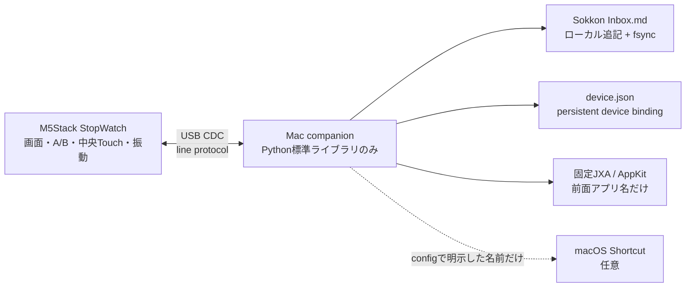

# SOKKON / 即今

> 現行実装と USB protocol v2 の設計・操作 — 2026-08-19
>
> SOKKON firmware（PlatformIO environment `10_sokkon`）と Mac companion は実装済みです。firmware build と companion の自動テストは成功しています。自動テストは実機の日常利用を代替しないため、最初の Flash と MARK は本書の受入手順で確認してください。「次段階」に記した機能は未実装です。

## 一文で言うと

M5Stack StopWatch を、研究・制作・経営・公共活動を横断しながら、**いま何に向き合っているかを物理的に支える界面**へ変える。

SOKKON は人格を再現する装置でも、落合陽一本人の文章や語り口を模倣する装置でもありません。複数の役割が一日のなかで高速に切り替わる状況を、次の三つの操作へ具体化したものです。

1. 現在の文脈を `MARK` して外部記憶へ残す。
2. 自分の役割を `MODE` として明示する。
3. 目の前の時間を `FOCUS` として身体的に区切る。

「即今」は、未来の計画表や過去のログを眺めるためではなく、現在を選び直すための名前です。

## 「支持界面」とは何か

SOKKON はタスクを自動決定しません。生産性を採点せず、常時監視もしません。人が現在へ戻るための、手触りのある小さな支点になります。

- **支持**: 次の行動を命令するのではなく、選んだ行動を保持する。
- **界面**: Mac の情報空間と、手元のボタン・タッチ・振動を接続する。
- **物理化**: mode、経過時間、記録の確定を、画面と触覚で知覚できる状態にする。

研究論文を読む、作品やコードを作る、組織を動かす、人前で話す、休む。これらを一つの「仕事」へ潰さず、同じ端末上で切り替えられることが重要です。

## 現行実装の全体像

現行実装は USB Type-C ケーブル一本で StopWatch と Mac companion を接続します。companion は Python 3 の標準ライブラリだけで動き、protocol v2 handshake の成立後に現在の前面アプリ名を端末へ送り、黄色 A の MARK をローカル Markdown file へ保存します。



### 現在実装済み

- Mac のローカル時刻と前面アプリ名を 1 秒ごとに表示
- `NOW / BUILD / READ / MEET / PRESENT / REST` の六 mode
- Mac接続時の自動mode分類と、青Bによる手動mode維持
- 端末内で動く FOCUS timer
- USB 接続 / 切断状態と RTC fallback 表示
- Markdown inbox への MARK、`flush`、`fsync`
- ACK と最終 RESULT を分けた保存確認
- protocol v2のpersistent device binding / boot session identity handshake
- EVENTは一度だけ送信し、30秒までRESULTを待つ確定境界
- 重複frameに対するside effect防止とsequence conflict拒否
- 失敗・timeout・未接続を成功と区別する振動
- 中央 hit area だけに限定した FOCUS touch
- 2 分後の減光、10 分後の消灯、微小 pixel shift
- 任意 Shortcut の厳格な config allowlist

### 現在は使わない

- 画面キャプチャ、OCR、ウィンドウタイトル、文書本文、キー入力
- 音声録音とマイク
- スピーカー音
- Wi-Fi、Bluetooth LE、クラウド、LLM API
- 任意 shell command、device から指定された command / Shortcut
- 生産性評価、行動の自動採点

## 画面

466 × 466 の丸形 AMOLED を一画面で使います。情報は色だけに依存せず、文字でも示します。

| 場所 | 現行表示 | 例 |
| --- | --- | --- |
| 上端 | connection、battery、charging | `USB BAT 84%+` / `LOCAL BAT 84%` |
| 上部 | Mac 時刻。切断時は RTC | `14:03` |
| 中央上 | mode | `BUILD` |
| 中央 | 前面アプリ名 | `Visual Studio Code` |
| その下 | mode の由来 | `AUTO MODE` / `MANUAL MODE` |
| 中央下 | focus state と経過時間 | `FOCUS / RUNNING`、`00:24:13` |
| 下部左右 | 物理ボタンの意味 | yellow `MARK`、blue `MODE` |
| 下端 | 保存済み MARK 数 | `MARKS 3` |

USB の heartbeat が 5 秒途絶えると `LOCAL` へ切り替わり、過去の前面アプリ名を現在値として残さず `MAC NOT CONNECTED` を表示します。時刻は RX8130CE RTC の値へ戻り、mode と FOCUS は端末内で使い続けられます。

長い app 名は画面幅に合わせて省略します。現行 firmware の host text は安全のため ASCII へ制限しており、日本語を含む app 名が `?` 表示になる場合があります。これは通信失敗ではありません。

## 六つの役割モード

青 B を押すたびに、次の順で循環します。

`NOW → BUILD → READ → MEET → PRESENT → REST → NOW`

| Mode | 意味 | 典型的な活動 | UI 色 |
| --- | --- | --- | --- |
| `NOW` | まだ分類しない現在 | 移動、着地、次の文脈を選ぶ | cyan |
| `BUILD` | 何かを構成する | 研究、実験、執筆、コード、制作 | orange |
| `READ` | 外部を取り込む | 論文、書籍、原稿、資料の review | green |
| `MEET` | 他者と意思決定する | 会議、経営、共同研究、調整 | blue |
| `PRESENT` | 公共へ開く | 講演、授業、取材、展示、発表 | magenta |
| `REST` | 意図して負荷を下げる | 休憩、移動の余白、回復 | gray |

companion 起動直後は、前面 app 名を小さな固定 rule で `NOW / BUILD / READ / MEET / PRESENT` のいずれかへ分類し、画面へ `AUTO MODE` と表示します。青 B を一度押すと、その時点の次 mode が手動値となり、以後は `MANUAL MODE` です。手動 mode は companion が USB 再接続しても同じ process の間は維持され、companion process を再起動すると AUTO に戻ります。`REST` は人が選ぶ mode で、自動分類しません。

mode は身分や人格ではなく、いまの活動に付ける一時的なラベルです。`REST` も有効な現在として同列に置きます。

## 三つの操作

### 黄色 A — MARK

現在の文脈を Mac の Markdown inbox へ一行追加します。保存する snapshot は次です。

- Mac の timezone 付き時刻
- A を押した時点の device mode
- Mac の前面 app 名
- FOCUS の `RUNNING / PAUSED`
- A を押した時点の FOCUS 経過時間

処理の順序は次の通りです。

1. StopWatch が device ID、boot session ID、sequence 付きの `CAPTURE` event を送る。
2. companion が同じ session ID と sequence を含む `ACK|...|ACCEPTED` を返す。これは受理だけで、保存成功ではない。
3. companion が Markdown を追記し、`flush` と `fsync` を行う。
4. config に `CAPTURE` Shortcut があれば、固定名を `shell=False` で非同期起動する。
5. Markdown の `fsync` が成功していれば、同じ session ID と sequence を含む `RESULT|...|OK` を返す。
6. StopWatch は RESULT OK を受けて初めて `MARK SAVED`、保存数加算、強い確定振動を出す。

`CAPTURE` の RESULT OK が保証する正本はMarkdownの`fsync`です。任意Shortcutを起動できない場合や、起動後に失敗した場合も、保存済みfileへ重複追記させないためRESULTはOKのままにし、詳細をTerminalのerror logへ残します。Shortcut workflowの最終成功をRESULTは保証しません。

既定の保存先は `~/Documents/Sokkon Inbox.md` です。最初の MARK で親 directory と file を作り、新規fileはmode `0600` で開きます。capture targetがsymlink、FIFO、directoryなどのnon-regular fileなら拒否します。

```markdown
# Sokkon Inbox

- 2026-08-19T14:03:22+09:00 [BUILD] MARK — app: Visual Studio Code — focus: RUNNING 00:24:13.000
```

未接続中は`NOT SAVED`、pending 8件が埋まっている場合は`MAC BUSY`となり、eventを送りません。Markdown書き込み失敗とdry-runはRESULT ERRORとなり、端末は`MAC ERROR`と3連振動を返します。offline queueはなく、未接続中のAは保存されません。

EVENTは操作時に一度だけ送信し、自動再送しません。端末は最終RESULTを30秒まで待ち、CAPTUREなら`SAVE UNKNOWN`、MODE / FOCUSなら`MAC TIMEOUT`と3連振動を返してpendingを破棄します。CAPTUREの`SAVE UNKNOWN`は「未保存」の断定ではありません。Macが`fsync`した後にRESULTだけ失われた可能性があるため、inboxを確認してから再試行してください。

### 青 B — MODE

六 mode を端末上で即時に切り替えます。接続中は `MODE_NEXT` event が companion へ渡り、手動 mode として保持されます。切断中でも device mode は循環します。

config に `MODE_NEXT` Shortcut がある場合だけ、その固定 Shortcutも非同期起動します。processを起動できなければRESULT ERRORですが、起動後のworkflow完了は待ちません。後発の終了errorや30秒超過はTerminalへ記録され、すでに返したRESULTは変更しません。端末上のmode切り替え自体はいずれの場合も巻き戻りません。

### 中央 Touch — FOCUS

画面中央から半径 145 px の領域を新しくタップすると FOCUS を start / pause します。外周タッチでは切り替わりません。

- 計測: device の monotonic clock
- Mac sleep / companion restart: device 側で計測継続
- USB 再接続: 現在の state を次 event に含める
- 画面消灯中の最初の中央 touch: 画面を起こすだけで timer は切り替えない
- reset: 現行の通常操作には割り当てていない

接続中は `FOCUS_TOGGLE` event を送り、config に対応ShortcutがあればMODEと同じ非同期方式で起動します。wall clock や NTP 補正は経過時間へ影響しません。

## 振動言語と画面保護

現行実装は speaker を鳴らさず、振動だけで結果を伝えます。

| 結果 | 現行 pattern | 意味 |
| --- | --- | --- |
| MARK sent | 弱く 1 回、30 ms | Mac へ送った。まだ保存確定ではない |
| MARK saved | 強く 1 回、90 ms | Markdown の `fsync` が成功。任意Shortcutの完了保証ではない |
| MAC ERROR | 3 回、各 45 ms | CAPTUREの書き込み失敗 / dry-run、またはMODE / FOCUS actionの起動失敗 / dry-run |
| SAVE UNKNOWN / MAC TIMEOUT | 3 回、各 45 ms | 30秒以内にRESULTなし。CAPTUREの保存成否は不明 |
| MODE changed | 1 回、35 ms | device mode 切り替え済み |
| FOCUS start | 2 回、各 30 ms | 計測開始 |
| FOCUS pause | 1 回、75 ms | 計測停止 |

操作が 2 分ないと brightness 20 へ減光し、10 分で brightness 0 へ消灯します。表示中は 1 分ごとに 1 px 程度の位置 shift を行います。ボタン操作は画面を起こして同時に実行され、消灯中の中央 touch は wake のみに使います。

## Mac companion

### 実装

`companion/` は Python 3 の標準ライブラリだけで実装されています。

- serial: `os.open`、`termios`、`select`。`pyserial` 不要
- protocol: 固定 pipe-delimited line parser
- config: `json` と strict key / value validation
- binding: device IDをlocal JSONへatomic replaceし、通常起動前に検証
- capture: `os.open`、append、`flush`、`fsync`
- time: timezone aware `datetime`
- serial port接続失敗後の再接続待ち: 2秒。EVENTの再送ではない
- duplicate protection: device / session / sequenceとevent fingerprintによるRESULT cache、最大256件

同じcompanion processでは、最初にhandshakeしたdevice IDをserial reconnect後もpinし、途中のidentity changeを拒否します。boot session IDが変われば同じsequenceも別eventとして扱います。RESULT cacheはsession identityをkeyとして継続保持し、cacheと手動modeはcompanion processの間だけ保持します。

### Persistent pairing

初回だけ、物理的に対象端末を確認してpairします。

```bash
make companion-pair ARGS="--port /dev/cu.usbmodemXXXX"
# 同等: python3 -m companion --pair --port /dev/cu.usbmodemXXXX
```

pair modeは`PING`を送り、protocol v2のREADYまたはPONGからdevice / session identityを読むhandshakeだけを行います。`STATE`や前面app名を送らず、EVENTやShortcutを実行せずに終了します。取得したdevice IDは既定で`~/.config/sokkon/device.json`へ保存します。新規fileはmode `0600`で、内容を一時fileへ書いて`fsync`した後にatomic replaceし、親directoryも`fsync`します。bindingは12桁hex device IDだけを持ち、symlink、non-regular file、1024 bytesを超えるfile、未知keyを拒否します。実機のIDやbinding fileはrepositoryへ記載・commitしません。

通常の`make companion`はbindingを必須とし、handshakeのdevice IDが保存値と違えば`STATE`、前面app名、actionを送らず拒否します。custom pathを使う場合は、pairと通常起動の両方へ同じ`--binding`を渡します。

```bash
make companion-pair ARGS="--binding /absolute/path/device.json"
make companion ARGS="--binding /absolute/path/device.json"
```

別個体を信頼し直す場合だけ、接続対象を物理的に確認して次を実行します。

```bash
make companion-pair ARGS="--port /dev/cu.usbmodemXXXX --replace-binding"
```

`--replace-binding`は`--pair`と同時にしか使えません。既存bindingと同じdeviceを再pairする場合は、このoptionなしで安全に終了します。

### 前面 app の取得

前面 app は、固定された JXA / AppKit expression を次の argv で直接実行し、`NSWorkspace.frontmostApplication.localizedName` だけを読みます。

```text
/usr/bin/osascript -l JavaScript -e <repository内の固定expression>
```

`shell=False` であり、device data や config text を script へ挿入しません。ウィンドウタイトル、本文、画面 pixel、キー入力は読みません。取得に失敗すると `Mac` へ fallback します。

これは「任意 shell を実行しない」という境界の、用途と code が固定された読み取り専用の例外です。追加 action はこの機構へ混ぜず、次の allowlisted Shortcuts だけを使います。

### config と Shortcuts

config は任意です。未指定時は既定 inbox と Shortcut なしで動きます。設定例は `companion/config.example.json` です。

```json
{
  "capture_path": "~/Documents/Sokkon Inbox.md",
  "shortcuts": {
    "CAPTURE": "Archive Sokkon Capture",
    "FOCUS_TOGGLE": "Toggle Focus",
    "MODE_NEXT": "Next Sokkon Mode"
  }
}
```

`shortcuts` の key はこの三 intent だけです。値は Shortcuts.app で人が作成・確認した固定名で、companion は `/usr/bin/shortcuts run <name>` を argv 配列、`shell=False`、stdout / stderrは`DEVNULL`で非同期起動します。device からShortcut名を指定できません。未知のconfig key、未知のintent、空・危険・長すぎるShortcut名は起動時に拒否します。

protocol RESULTはprocessを起動できた時点で返し、serial loopをShortcut完了待ちでblockしません。background reaperが最大30秒待ってlauncherを回収し、timeoutまたは非zero終了はTerminalへ記録します。これらの後発結果は、すでに返したprotocol RESULTを変更しません。起動自体に失敗した場合、MODE / FOCUSはRESULT ERROR、CAPTUREはMarkdownが`fsync`済みならRESULT OKです。dry-runで設定済みShortcutを省略したMODE / FOCUSはRESULT ERRORになります。

Shortcut はすべて任意です。各 Shortcut が Files、Calendar などの権限を要求する場合、その権限と処理内容は Shortcuts.app 上で確認してください。SOKKON 自体の必須権限ではありません。

## USB protocol v2

USB CDC、115200 bps、UTF-8、一行一frameの固定pipe protocolです。JSON / NDJSONではありません。`10_sokkon` environmentは共通設定から`CORE_DEBUG_LEVEL=5`を解除し、Arduino coreやlibraryのverbose logが同じserial streamへ混ざってframe境界を壊すことを防ぎます。

### Handshake、identity、heartbeat

```text
device -> Mac: SOKKON|READY|2|<12hex device_id>|<16hex session_id>
Mac    -> device: PING
device -> Mac: SOKKON|PONG|2|<12hex device_id>|<16hex session_id>
Mac    -> device: STATE|14:03|BUILD|Visual Studio Code|AUTO MODE
```

`device_id`はdevice固有の12桁hex、`session_id`はfirmware起動ごとに生成する16桁hexです。deviceは起動時にREADYを送り、PINGにはPONGを返します。pair後の通常起動では、companionはprotocol versionと保存済みdevice IDが一致するREADYまたはPONGを受けるまでhandshake未成立とし、`STATE`と前面app名を送らず、到着したEVENTも実行しません。成立後は同じdevice / session identityのEVENTだけを処理します。同じcompanion processではdevice IDをreconnect間でもpinし、別deviceへのidentity changeを拒否します。

これは暗号認証ではありません。trust boundaryは、初回pair時にユーザーが確認した物理USB接続、選択した`/dev/cu.usbmodem*`、永続化したdevice ID、protocol v2 schema、起動ごとのsession identityです。bindingは偶発的な別端末への接続を拒否しますが、device IDを知ってprotocolを模倣するdeviceに対するcryptographic authenticationは提供しません。自動検出は候補が一つのときだけ行い、複数なら`--port`の明示を要求します。

handshake成立後、companionは`STATE`を1秒ごとに送ります。deviceは妥当な`PING / STATE / ACK / RESULT`を受けた時だけhost heartbeatを更新し、5秒途絶えるとLOCALへ戻ります。

### Device event — 9 fields

```text
EVENT|02AABBCCDDEE|0123456789ABCDEF|42|CAPTURE|8123000|BUILD|RUNNING|1453000
```

| Field | 例 | 意味 |
| ---: | --- | --- |
| 1 | `EVENT` | frame type |
| 2 | `02AABBCCDDEE` | 12桁hex device ID（架空のlocally administered値） |
| 3 | `0123456789ABCDEF` | 16桁hex boot session ID |
| 4 | `42` | unsigned 32-bit sequence |
| 5 | `CAPTURE` | `CAPTURE / MODE_NEXT / FOCUS_TOGGLE` |
| 6 | `8123000` | device uptime ms |
| 7 | `BUILD` | 操作時の mode snapshot |
| 8 | `RUNNING` | 操作時の focus state |
| 9 | `1453000` | 操作時の elapsed ms |

CAPTURE は event を発生させた瞬間の device snapshot（mode / focus / elapsed）を正本とし、companion が Mac 時刻と前面 app を加えて保存します。接続中に STATE heartbeat とボタン操作が近接しても、MARK は画面操作時の値で記録されます。

### ACK と RESULT

```text
Mac -> device: ACK|0123456789ABCDEF|42|ACCEPTED
Mac -> device: RESULT|0123456789ABCDEF|42|OK
Mac -> device: RESULT|0123456789ABCDEF|42|ERROR|CAPTURE_WRITE_FAILED
```

- ACK: schemaとidentityを受理した。side effect完了ではない
- RESULT OK（CAPTURE）: Markdown fileの`fsync`成功。任意Shortcutの完了は保証しない
- RESULT OK（MODE / FOCUS）: 設定済みShortcutがなければ受付完了、あればlauncherの起動成功。workflow完了は保証しない
- RESULT ERROR: capture書き込み失敗、CAPTURE dry-run、MODE / FOCUSのlauncher起動失敗、設定済みactionのdry-run、sequence conflictなど
- ACK / RESULTはEVENTのsession IDをechoし、firmwareは現在のboot sessionと一致しない応答を無視する
- device pending slots: 8。満杯なら新eventを送らず`MAC BUSY`
- send policy: 各EVENTは一度だけ送信し、自動再送しない
- final timeout: event生成から30秒。CAPTUREは`SAVE UNKNOWN`、MODE / FOCUSは`MAC TIMEOUT`

重複判定はdevice ID + session ID + sequence + event fingerprintです。cache indexは`(device_id, session_id, sequence)`、fingerprintはintent、uptime、mode、focus、elapsedのsnapshotです。通常firmwareは再送しませんが、同一duplicate frameを受信した場合はcached RESULTを返し、file追記やShortcut起動を再実行しません。同じindexでfingerprintが違うframeは`SEQUENCE_CONFLICT`として拒否します。cacheは最大256件で、同じcompanion processのserial reconnectとREADY受信をまたいで保持されますが、process再起動後までは永続化しません。このcacheは防御的検査であり、firmwareのdelivery retryには使いません。

protocolはfield数、数字の範囲、mode、focus、intent、statusを両側で検証します。companionから送るcontext / detailは各96 UTF-8 bytes、error reasonは64 UTF-8 bytesへ丸め、field内の`|`、CR、LFを除去・置換します。companionのserial inputは1024-byte line上限を持ち、桁数が異常に大きいnumeric fieldも整数化前に拒否します。deviceは256-byte受信bufferを超えたframeを捨てます。未知・過剰・壊れたframeはactionとして実行しません。

## プライバシーと権限

| 対象 | 現行実装の扱い |
| --- | --- |
| 画面文脈 | app 名だけ。USB ローカル通信のみ |
| ウィンドウタイトル / 本文 | 取得しない |
| 画面収録 / Accessibility | 要求しない |
| マイク | 使用・録音しない |
| network | companion自身は使用しない。macOS / iCloudによるOS側file同期は別 |
| speaker | 使用しない |
| 任意 shell / command | 実行しない |
| 固定 system program | 前面 app 用の固定 JXA、config allowlist のShortcutsのみ。常に`shell=False` |
| 保存先 | 指定したMarkdown file一つ。symlink、FIFO、non-regular targetは拒否 |
| device binding | 既定は`~/.config/sokkon/device.json`。12桁hex IDだけを新規mode `0600`、`fsync`、atomic replaceで保存 |

通常 log は接続・error だけです。`--verbose` は protocol frame を Terminal へ表示するため、前面 app 名が Terminal scrollback に残ります。必要な調査時だけ使ってください。

companionのcode自身はnetwork connectionを開きません。ただし既定保存先`~/Documents/Sokkon Inbox.md`は、macOSの「デスクトップと書類フォルダ」やiCloud Driveなどの設定により、OSが同期する場合があります。厳密にlocalだけへ置く場合は、同期対象外の`capture_path`をconfigで指定し、macOS側の同期設定も確認してください。

Markdown履歴が正本で、StopWatchには現在値と当該起動中の保存件数だけを表示します。USBを抜けばdeviceとMacの情報流通は止まり、offline MARKは保存されません。ただし、すでに書かれたfileのOS側同期までUSB切断で停止するわけではありません。

## 即日使い始める

### 1. 初回だけ — backup と Flash

データ対応 USB Type-C ケーブルを使い、最初の書き込みより前に [FLASHING.md](FLASHING.md) の factory backup を実施します。

```bash
cd /path/to/m5stack-stopwatch

./scripts/detect-port.sh
make device-info PORT=/dev/cu.usbmodemXXXX
make backup PORT=/dev/cu.usbmodemXXXX

make build ENV=10_sokkon
make flash ENV=10_sokkon PORT=/dev/cu.usbmodemXXXX
```

書き込み後、必要なら電源ボタンを短押しして起動します。serial monitor と companion は同じ port を同時に開けないため、`make monitor` は閉じてください。

### 2. 初回だけ — deviceをpair

serial monitorを閉じ、接続対象を物理的に確認してhandshakeだけを実行します。

```bash
make companion-pair ARGS="--port /dev/cu.usbmodemXXXX"
```

既定bindingは`~/.config/sokkon/device.json`です。pair modeはapp context、STATE、actionを送らず終了します。通常起動はこのbindingがないと開始しません。別個体へ交換する場合は [Persistent pairing](#persistent-pairing) の`--replace-binding`手順を使います。

### 3. 毎日 — companion を起動

接続された `/dev/cu.usbmodem*` が一つだけなら自動検出します。

```bash
make companion
```

port を固定する場合:

```bash
make companion ARGS="--port /dev/cu.usbmodemXXXX"
```

既定では config file 不要で、最初の黄色 A により `~/Documents/Sokkon Inbox.md` が作られます。終了は `Ctrl-C` です。

### 4. 任意 — 保存先と Shortcuts を設定

repository 外に local config を作る例です。

```bash
mkdir -p ~/.config/sokkon
cp companion/config.example.json ~/.config/sokkon/config.json
```

JSON を編集した後:

```bash
make companion ARGS="--port /dev/cu.usbmodemXXXX --config ~/.config/sokkon/config.json"
```

### 5. 最初の受入確認

1. 3 秒以内に画面が `USB` となり、Mac 時刻と前面 app が出る。
2. 青 B で六 mode が順番どおり循環し、`MANUAL MODE` になる。
3. 中央 touch で FOCUS が start / pause する。
4. 黄色 A を一度押し、短い送信振動の後に強い `MARK SAVED` 振動が来る。
5. `~/Documents/Sokkon Inbox.md` に一行だけ増え、時刻・mode・app・focus が一致する。
6. USB を抜き、`LOCAL / MAC NOT CONNECTED` となる。
7. offline で黄色 A を押し、`NOT SAVED` と 3 連振動になり inbox が増えない。

### 補助 command

```bash
# 接続とSTATE送信を短く確認して終了
make companion-once ARGS="--port /dev/cu.usbmodemXXXX"

# fileもShortcutも変更しない。MARKはERROR / DRY_RUN_NOT_SAVED
# 設定済みShortcutを省略するMODE / FOCUSもERROR
make companion ARGS="--port /dev/cu.usbmodemXXXX --dry-run"

# protocolを含む詳細log。前面app名がTerminalに残る点に注意
make companion ARGS="--port /dev/cu.usbmodemXXXX --verbose"
```

## 検証状態と既知の境界

```bash
make build ENV=10_sokkon
make companion-test
```

2026-08-19 時点で`10_sokkon` firmware buildは成功し、Mac companionは42 testsが成功しています。testsはpersistent binding / pairing CLIとexpected-device mismatch、protocol v2 handshake / identity、config、UTF-8 byte bounds、capture / fsyncとnon-regular target拒否、front app分類、Shortcut allowlist / async launcher、serial size limits、duplicate / conflict handling、PTY integrationを含みます。

現在の境界:

- 実機 Flash 後の画面、ボタン、touch、振動、実 file追記は上記受入手順で個体ごとに確認する。
- app 名表示は ASCII 中心。日本語文字の完全表示は未対応。
- mode / FOCUS は device reboot 後に初期化される。
- companion は接続中の mode の正本でもある。切断中に device だけで変更した mode は、その場では使えるが、再接続時に companion が保持する MANUAL mode または新しい AUTO mode で置き換わる。
- RTC は LOCAL 時刻表示に使うが、host との自動時刻補正と offline MARK queue は未実装。
- companion は一つの StopWatch、一つの inbox を前提にする。
- firmwareはEVENTを一度だけ送り、自動再送しない。frameまたはRESULTが失われても自動delivery recoveryは行わず、30秒後にCAPTUREは`SAVE UNKNOWN`、MODE / FOCUSは`MAC TIMEOUT`となる。
- CAPTURE Shortcutの成否は保存確定と分離する。Markdownが`fsync`済みなら端末は`MARK SAVED`を返し、Shortcutの起動失敗、後発error、30秒超過はTerminal logで確認する。
- MODE / FOCUSの設定済みShortcutはlauncher起動失敗ならRESULT ERRORとなるが、起動後のworkflow成否はRESULTへ反映しない。

## 次段階 — 未実装ロードマップ

搭載ハードを使う魅力は大きい一方、便利さと同じ速度で権限面積も広がります。低リスク・device local から進めます。

| 優先 | 未実装機能 | 体験 | 追加権限・リスク | 実装条件 |
| ---: | --- | --- | --- | --- |
| P1 | RTC 完全 offline | host 時刻同期、再起動後の正しい時刻、offline MARK候補 | 低。drift、timezone、未保存との混同 | host / RTC の正本規則。pending は保存済みと別表示 |
| P1 | IMU gesture | 腕を返して wake、伏せて REST、持ち上げて NOW | 低。誤検出、意図しないmode変更 | 初期はwakeだけ。mode変更は画面確認を要求 |
| P1 | speaker / haptic cue queue | 会議終了、発表開始、focus節目を予約通知 | 低〜中。騒音、割り込み | 現行の直接hapticと分離。haptic既定、speakerはmode別opt-in |
| P2 | Bluetooth LE transport | USB cableを外して近距離連携 | 中。無線追跡、なりすまし、pairing | GATT実機検証、pairing、明示connect、advertisingへ文脈を載せない |
| P2 | 外部 I2C context | 温湿度、照度、距離などを現在へ加える | 中。5 V、配線、誤解釈 | G10 SDA / G11 SCL、3.3 V logic、sensorをconfigで明示 |
| P3 | mic voice memo | MARKを数秒の声で補足 | **高**。周囲の音声、同意、個人情報 | 長押し中だけ録音、常時REC表示、保存先明示、cloud送信禁止 |
| P3 | Wi-Fi API | 展示、予定、研究環境、公開systemと連携 | **高**。network、token、remote command | host allowlist、最小schema、TLS、rate limit。汎用command禁止 |

### IMU gesture

BMI270 は加速度とジャイロの 6 軸で、磁気センサーはありません。絶対方位を前提にせず、「持ち上げた」「伏せた」「静止した」のような短い動作に限定します。gesture が MARK や MODE を無確認で確定する設計にはしません。

### Bluetooth LE

ESP32-S3 は Bluetooth LE の SoC 能力を持ち、repository に `07_ble_gatt` 診断 firmware がありますが、SOKKON transport は未実装です。USB protocol v2 の intent / identity / RESULT semanticsを維持し、transportだけを置き換えます。device名、mode、front appをadvertising payloadへ載せません。

### マイク、スピーカー、振動

`04_audio_haptics` で個別ハードを試せますが、SOKKON の音声 memo と cue queue は未実装です。録音は明示操作中だけにし、画面全体へ REC を出します。内蔵マイクとスピーカーは同時使用できません。会議や公共活動で他者の声を含むため、技術的に可能でも既定無効にします。

### RTC

現在も切断時の時刻表示には RX8130CE を使います。次段階は Mac からの安全な時刻同期、timezone、drift、再起動、offline MARK の扱いまでを一つの設計として完成させることです。offline timestamp があっても、Markdownへ保存される前は `SAVED` と表示しません。

### 外部 I2C

`08_external_i2c` で Port A scan はできますが、SOKKON の context 連携は未実装です。Port A は G10 / G11 と 5 V 電源を持ち、GPIO は 3.3 V logic です。背面の `BAT` 誤印字ピンは実際には 5V IN なので、リチウム電池を接続しません。詳しくは [HARDWARE.md](HARDWARE.md) を参照してください。

### Wi-Fi API

`05_wifi_scan` は診断用で、現行SOKKONのfirmwareとcompanion自身はnetworkを使いません。将来も接続先hostとschemaを明示し、API tokenをfirmware、Git、serial logへ入れません。任意URL、任意JSON、remote shellを受ける汎用endpointは設けません。

## 成功指標

SOKKON の成功は、収集したデータ量では測りません。

- 役割を切り替える瞬間に、迷いが一呼吸ぶん減ったか。
- MARK が後から読める外部記憶になったか。
- FOCUS が画面内の timer ではなく、身体的な開始・停止になったか。
- 研究、制作、経営、公共活動、休息のどれか一つを特権化していないか。
- 一日つないでも監視されている感覚がないか。
- USB を抜けばdeviceとMacの情報流通が止まる、と直感的に理解できるか。

一日の終わりに inbox の行を人が読み、不要なら消せること。端末が人を分類するのではなく、人が自分の現在を選び直せること。それが SOKKON / 即今の完成条件です。
